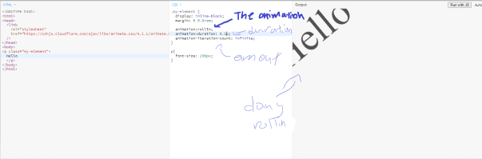

# Entry 4
##### 2/16/24

## Content
After entry 03 of brainstorming about the idea and coming up with new ideas for futcher, In Entry 04 I will be choosing a tool for decoration for the website, and I chose animation css.

### Animation css
So what is animation css? you may ask. Will animation css is basically using CSS to allow animation of HTML elements without using JavaScript! by using animation css you can amazing stuff without javascript like

* `animation-delay` Determines the interval between loading an element and starting an animation sequence, and whether or not the animation should begin immediately from its beginning.
* `animation-direction` Indicates if the first iteration of an animation should be forward or backward, and if iterations after that should repeat in the same direction or change direction each time the sequence is executed.
* `animation-duration` Determines the duration of time an animation takes to complete one cycle.
* `animation-fill-mode` Defines the method by which an animation applies styles to its target both before and after it begins.
* `animation-iteration-count` Specifies the number of times an animation should be repeated.
* `animation-name` Specifies the name of the `@keyframes` at-rule describing an animation's keyframes.
* `animation-play-state` Indicates whether an animation sequence should be played or paused.
* `animation-timeline` defines the timetline that a CSS animation uses to manage its progress.
* `animation-timing-function` describes the acceleration curves that are used to specify the keyframe transitions in an animation.

and many more.

#### How I tinkered with it
I used Jsbin and input the code and see the outcome

----

### Skill
One skill I learned from this entry was tinkering, how I could tinker with my tool first by trying it out and choosing the one I like the most and the one that fit me the best.

[Previous](entry03.md) | [Next](entry05.md)

[Home](../README.md)

