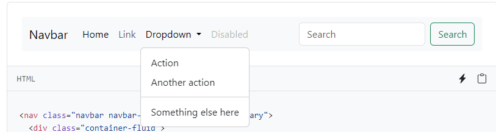

# Entry 5
##### 4/14/24

## Content
In Entry 5 I'm getting ready to build my website for my freedom project, but when building a website, first you need to build a wireframe, for the draft of the website, and in entry  5 I went farther beyond learning my tool that i'm going to be using for my website, I also learn about Bootstrap to organizing the format of my website.


## Bootstrap

Bootstrap is an open-source, free, and responsive CSS framework for mobile-first web development. Bootstrap is a collection of HTML, CSS, and JavaScript design templates for fonts, shapes, buttons, navigations, and other UI elements. Bootstrap is able to re-present the layout of the website for fitting the size of your screen.

### grid
The Bootstrap grid system arranges and aligns content using a set of rows, columns, and containers. It is completely responsive and constructed with Flexbox.

**Containers** are Bootstrap’s base layout elements and are used when our default grid is used. Containers contain, position, and (in some cases) center your content. Containers can also be nested, but most layouts don’t need a nested container.

**Row:** The “row” class in Bootstrap is primarily used to store columns within a row. Each row in Bootstrap is divided into 12 virtual columns. For example, the col-md-6 div will have the width of 6/12 of the "row" div, meaning 50%. The col-md-4 will hold 33.3%, and the col-md-2 will hold the remaining 16.66%

**col** you can specify the col class for a certain number of elements, and Bootstrap will automatically calculate the number of elements (and generate equal-width columns).

### Navbar
using bootstrap you can make cool stuff like Navbar. Navbar is one thing I'm definitely going to be using in my website, because using Navbar you can get a table of content for your website and it can take people the part they want to see quickly.

```
<nav class="navbar navbar-expand-lg bg-body-tertiary">
  <div class="container-fluid">
    <a class="navbar-brand" href="#">Navbar</a>
    <button class="navbar-toggler" type="button" data-bs-toggle="collapse" data-bs-target="#navbarSupportedContent" aria-controls="navbarSupportedContent" aria-expanded="false" aria-label="Toggle navigation">
      <span class="navbar-toggler-icon"></span>
    </button>
    <div class="collapse navbar-collapse" id="navbarSupportedContent">
      <ul class="navbar-nav me-auto mb-2 mb-lg-0">
        <li class="nav-item">
          <a class="nav-link active" aria-current="page" href="#">Home</a>
        </li>
        <li class="nav-item">
          <a class="nav-link" href="#">Link</a>
        </li>
        <li class="nav-item dropdown">
          <a class="nav-link dropdown-toggle" href="#" role="button" data-bs-toggle="dropdown" aria-expanded="false">
            Dropdown
          </a>
          <ul class="dropdown-menu">
            <li><a class="dropdown-item" href="#">Action</a></li>
            <li><a class="dropdown-item" href="#">Another action</a></li>
            <li><hr class="dropdown-divider"></li>
            <li><a class="dropdown-item" href="#">Something else here</a></li>
          </ul>
        </li>
        <li class="nav-item">
          <a class="nav-link disabled" aria-disabled="true">Disabled</a>
        </li>
      </ul>
      <form class="d-flex" role="search">
        <input class="form-control me-2" type="search" placeholder="Search" aria-label="Search">
        <button class="btn btn-outline-success" type="submit">Search</button>
      </form>
    </div>
  </div>
</nav>
```


## Wireframe

With Wireframe we can create a basic idea about how we are going to make the website, it allow us to create the actual website with a idea in mind and it make it so less mistake and create the MVP first.


[Previous](entry04.md) | [Next](entry06.md)

[Home](../README.md)