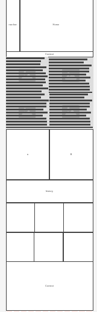
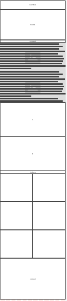

# Plan

## Wireframes

* [Mobile](https://wireframe.cc/u25D8C)
* [Desktop](https://wireframe.cc/beivsp)

## Colors
* `#ABC123`

## Fonts
* [Text](URL)

## Timeline

#### MVP
4/18 finish home page
4/19 finish nav bar
4/20 work on context
4/21 work on context
4/22 finish it and start on a
4/24 finish a and b
4/25 start history
4/26 finish history
4/27 finish the end

---

#### Beyond MVP

* Add more animation css and animate css
* -[x]add Grid and bootstrap
* -[x]add color
* -[x]word font
* -[]fix navbar
* -[]fix contact
